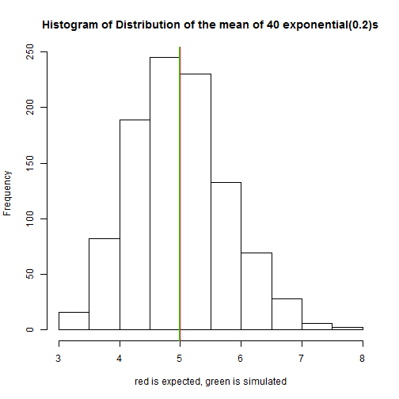
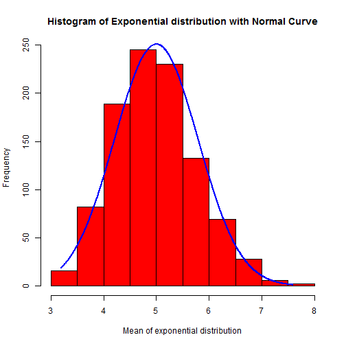

Title: "Statistical Inference Course Project 1: A simulation exercise"
---------------------------------------------
Date: "Sunday, December 21, 2014"
--------------------------------------------

```r
#prefined values
lambda = .2
n = 40
#number of simulations
numofsims = 1:1000
```
In order for us to observe the distribution of averages of 40 exponential(0.2)s we were asked to perform a thousand simulated averages of 40 exponentials. To do this lets make a function that will generate the mean of the mean of 40 expotential(0.2)s. Then we can observe it's distribution and compare it to its theoretical center. 

```r
mean_rexp <- sapply(numofsims, function(x) { mean(rexp(runif(n), lambda))}, USE.NAMES =TRUE)

#lets see how the data looks
head(mean_rexp)
```

```
## [1] 5.395 6.076 5.140 3.855 3.995 5.522
```

```r
#generate a summary of the data
summary(mean_rexp)
```

```
##    Min. 1st Qu.  Median    Mean 3rd Qu.    Max. 
##    3.18    4.42    4.93    4.98    5.48    7.58
```

Questions 1
-----------
We were told the mean of exponential distribution is 1/lambda which equals 0.5. Lets show where the distribution is centered and then we can compare it (1/lambda=0.5) to the theoretical center of the distribution. At 1,000 simulations we will see the distribution will be centered around the mean by plotting a histogram and then looking at the results of the mean function(below). We see that both the simulated mean and expected mean are centered around 5. 5 (expected) and 4.965 (simulated).      


```r
#expected mean
1/lambda
```

```
## [1] 5
```

```r
#simulated mean
mean(mean_rexp)
```

```
## [1] 4.985
```

```r
#plot means
hist(mean_rexp, main="Histogram of Distribution of the mean of 40 exponential(0.2)s", xlab="red is expected, green is simulated")
abline(v=mean(mean_rexp),col="green")
abline(v=mean(1/lambda),col="red")
```

 
Question 2
----------
Above we can see how variable the distribution is by viewing its standard deviation and variance. We were told the standard deviation is also 1/lambda/sqrt(n), So we can now compare the expected variance to the theoretical variance.Since we can derive the variance from the standard deviation using the sd and n we can compare the expected and ones from the simulated data below. We can see both the expected and simulated standard deviation and variance are closely comparable. Standard deviation(expected=0.7906, simulated=0.784) and Variance(expected=0.625, simulated=0.6147)


```r
#expected standard deviation
(1/lambda)/sqrt(n)
```

```
## [1] 0.7906
```

```r
#simulated standard deviation
sd(mean_rexp)
```

```
## [1] 0.77
```

```r
#expected variance is ((1/lambda)/sqrt(n)) squared so:
((1/lambda)/sqrt(n))^2
```

```
## [1] 0.625
```

```r
#variance from simulated data
var(mean_rexp)
```

```
## [1] 0.5929
```
Question 3
----------
Here we want to show that the distribution is approximately normal. To do this we will plot our averages of 40 exponentials and overlay it with a normal distrubtion of random exponentials that have a similar mean and standard deviation. By doing this we can compare directly if our simulated distribution is normal distributed. By observing the histogram and overlay below we can see that the distribution is in fact normally distributed.


```r
x <- mean_rexp

h <-hist(x, col="red", xlab="Mean of exponential distribution", main="Histogram of Exponential distribution with Normal Curve") 

#lets generate a sequence of exponential values that are as long as our averages and we will use this as our normal density plot against our average exponentials. 
xfit <- seq(min(x),max(x),length=length(mean_rexp)) 

#plot a normal density distribution from our sequence 
yfit <- dnorm(xfit,mean=5,sd=(0.7951)) 

yfit <- yfit*diff(h$mids[1:2])*length(x) 
#add the norm dist line over the histogram
lines(xfit, yfit, col="blue", lwd=2)
```

 

