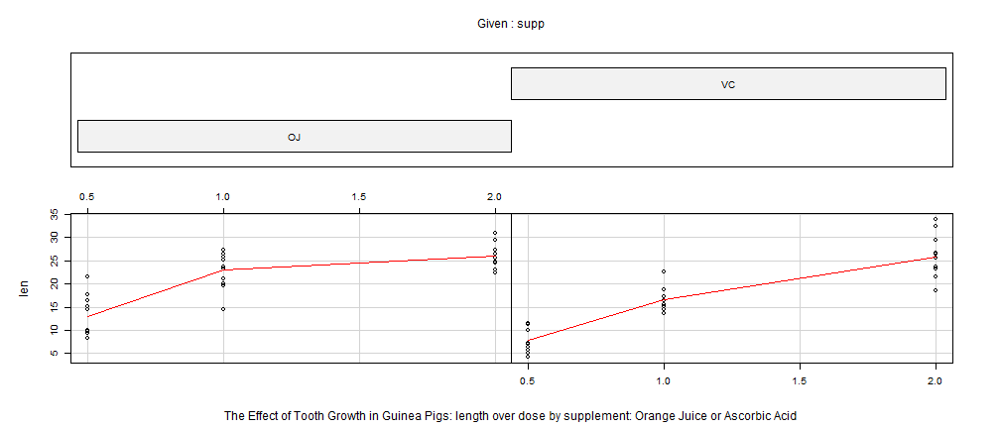
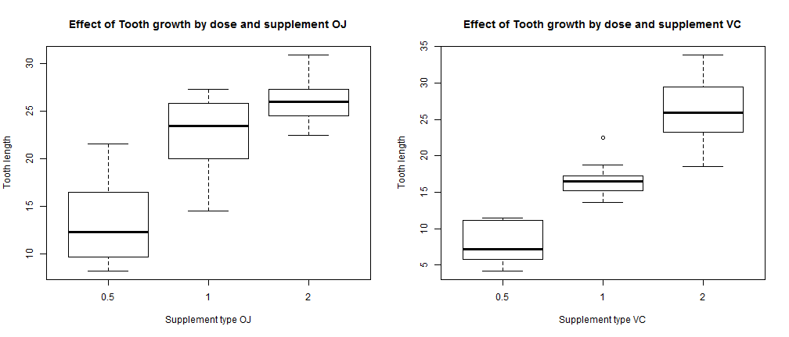

Title: "Statistical Inference Course Project 2: An Inferential data analysis"
---------------------------------------------
Date: "Sunday, December 21, 2014"
--------------------------------------------
Here we will load and provide a summary of the data package Tooth Growth.


```r
#load the data package
data(ToothGrowth)
#peek to see its structure
head(ToothGrowth)
```

```
##    len supp dose
## 1  4.2   VC  0.5
## 2 11.5   VC  0.5
## 3  7.3   VC  0.5
## 4  5.8   VC  0.5
## 5  6.4   VC  0.5
## 6 10.0   VC  0.5
```

```r
#give me a more comprehensive look at the data structure
str(ToothGrowth)
```

```
## 'data.frame':	60 obs. of  3 variables:
##  $ len : num  4.2 11.5 7.3 5.8 6.4 10 11.2 11.2 5.2 7 ...
##  $ supp: Factor w/ 2 levels "OJ","VC": 2 2 2 2 2 2 2 2 2 2 ...
##  $ dose: num  0.5 0.5 0.5 0.5 0.5 0.5 0.5 0.5 0.5 0.5 ...
```

```r
#what are the names of the columns
names(ToothGrowth)
```

```
## [1] "len"  "supp" "dose"
```

```r
#what are the dimensions of the data 
dim(ToothGrowth)
```

```
## [1] 60  3
```

```r
#Lets look at a summary of the data
summary(ToothGrowth)
```

```
##       len       supp         dose     
##  Min.   : 4.2   OJ:30   Min.   :0.50  
##  1st Qu.:13.1   VC:30   1st Qu.:0.50  
##  Median :19.2           Median :1.00  
##  Mean   :18.8           Mean   :1.17  
##  3rd Qu.:25.3           3rd Qu.:2.00  
##  Max.   :33.9           Max.   :2.00
```

```r
ToothGrowth_OJ <- subset(ToothGrowth, ToothGrowth[,2] =='OJ')

ToothGrowth_VC <- subset(ToothGrowth, ToothGrowth[,2] =='VC')

#The help page also displays a nice way to visualize the data set
require(graphics)
coplot(len ~ dose | supp, data = ToothGrowth, panel = panel.smooth, xlab ="The Effect of Tooth Growth in Guinea Pigs: length over dose by supplement: Orange Juice or Ascorbic Acid")
```

 


```r
par(mfrow=c(1,2))
boxplot(ToothGrowth_OJ[,1]~ToothGrowth_OJ[,3],data=ToothGrowth_OJ, main="Effect of Tooth growth by dose and supplement OJ", xlab="Supplement type OJ", ylab="Tooth length")

boxplot(ToothGrowth_VC[,1]~ToothGrowth_VC[,3],data=ToothGrowth_VC, main="Effect of Tooth growth by dose and supplement VC", xlab="Supplement type VC", ylab="Tooth length")
```

 

```r
toothgrowthmeans <- aggregate(ToothGrowth$len,list(ToothGrowth$supp,ToothGrowth$dose),FUN=mean)

summary(toothgrowthmeans)
```

```
##  Group.1    Group.2            x        
##  OJ:3    Min.   :0.500   Min.   : 7.98  
##  VC:3    1st Qu.:0.625   1st Qu.:14.12  
##          Median :1.000   Median :19.73  
##          Mean   :1.167   Mean   :18.81  
##          3rd Qu.:1.750   3rd Qu.:25.22  
##          Max.   :2.000   Max.   :26.14
```

```r
toothgrowthvar <- aggregate(ToothGrowth$len,list(ToothGrowth$supp,ToothGrowth$dose),FUN=var)


se <- function(x) sqrt(var(x)/length(x))

toothgrowthsd <- aggregate(ToothGrowth$len,list(ToothGrowth$supp,ToothGrowth$dose),FUN=sd)

toothgrowthse <- aggregate(ToothGrowth$len,list(ToothGrowth$supp,ToothGrowth$dose),FUN=se)


summary(toothgrowthsd)
```

```
##  Group.1    Group.2            x       
##  OJ:3    Min.   :0.500   Min.   :2.52  
##  VC:3    1st Qu.:0.625   1st Qu.:2.68  
##          Median :1.000   Median :3.33  
##          Mean   :1.167   Mean   :3.51  
##          3rd Qu.:1.750   3rd Qu.:4.32  
##          Max.   :2.000   Max.   :4.80
```

```r
summary(toothgrowthse)
```

```
##  Group.1    Group.2            x        
##  OJ:3    Min.   :0.500   Min.   :0.795  
##  VC:3    1st Qu.:0.625   1st Qu.:0.847  
##          Median :1.000   Median :1.053  
##          Mean   :1.167   Mean   :1.111  
##          3rd Qu.:1.750   3rd Qu.:1.367  
##          Max.   :2.000   Max.   :1.517
```

```r
summary(toothgrowthvar)
```

```
##  Group.1    Group.2            x        
##  OJ:3    Min.   :0.500   Min.   : 6.33  
##  VC:3    1st Qu.:0.625   1st Qu.: 7.17  
##          Median :1.000   Median :11.42  
##          Mean   :1.167   Mean   :13.19  
##          3rd Qu.:1.750   3rd Qu.:18.74  
##          Max.   :2.000   Max.   :23.02
```

```r
ToothGrowth_var_oj <- subset(toothgrowthvar, toothgrowthvar[,1] =='OJ')

ToothGrowth_var_vc <- subset(toothgrowthvar, toothgrowthvar[,1] =='VC')

mean(ToothGrowth_var_oj[,3])
```

```
## [1] 14.08
```

```r
mean(ToothGrowth_var_vc[,3])
```

```
## [1] 12.3
```
So I can see that there are differences between dose and supplement type and now I want to use confidence intervals and hypothesis testing to compare tooth growth by supp and dose. To do this I will run a t-test. As shown above I can see that mean variances are unequal and I have no way of knowing if these sample animals had been tested under both supplements so its safe to assume these are not paired. So I will run an unpaired t-test. 


```r
t.test(len ~ supp, data = ToothGrowth)
```

```
## 
## 	Welch Two Sample t-test
## 
## data:  len by supp
## t = 1.915, df = 55.31, p-value = 0.06063
## alternative hypothesis: true difference in means is not equal to 0
## 95 percent confidence interval:
##  -0.171  7.571
## sample estimates:
## mean in group OJ mean in group VC 
##            20.66            16.96
```
So it does not appear with a p-value 0.06 that tooth growth was significantly effected (with 95% confidence interval) in Guinea Pigs by both supplements. This includes both Orange Juice and Ascorbic Acid at all doses. For us to be able to compare the supplements we should subset by dose and then directly compare the supplements with statistical confidence. this way we can answer the question of by dose which supplement having the strongest effect on tooth growth.

```r
ToothGrowth_dose0.5 <- subset(ToothGrowth, ToothGrowth[,3] == '0.5')
ToothGrowth_dose1 <- subset(ToothGrowth, ToothGrowth[,3] == '1')
ToothGrowth_dose2 <- subset(ToothGrowth, ToothGrowth[,3] == '2')

ToothGrowth_dose0.5test <- t.test(len ~ supp, data = ToothGrowth_dose0.5)

ToothGrowth_dose1test <- t.test(len ~ supp, data = ToothGrowth_dose1)

ToothGrowth_dose2test <- t.test(len ~ supp, data = ToothGrowth_dose2)

p.value.results <- cbind(ToothGrowth_dose0.5test$p.value, ToothGrowth_dose1test$p.value, ToothGrowth_dose2test$p.value)

colnames(p.value.results) <- c(".5 dose", "1.0 dose", "2.0 dose")

p.value.results
```

```
##       .5 dose 1.0 dose 2.0 dose
## [1,] 0.006359 0.001038   0.9639
```
So are initial question is: Are there any differences between the two delivery methods (orange juice or ascorbic acid). The null hypothesis is that there is no difference between them. Dose .05 and Dose 1 show that there p-values are both less than .05 so we can say that these methods are different and we reject the null hypothesis. Dose 2 has a p-value of .96 so we accept the null hypothesis that at Dose 2 the two supplements are similar and there is not difference between them. 
